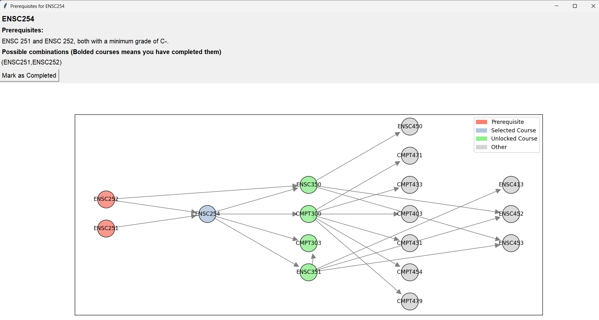

# SFU-Courses-Prerequisite
Course planning is a critical part of academic success that students often overlook. While the SFU program has graduation requirements that can act as a general guideline, students still face challenges in understanding how their other courses may connect to future opportunities that are not mandatory for their program. Courses have clearly defined prerequisites, but there is not much information regarding what that class leads to. A lot of students only start properly planning once they are close to graduation, but you want to make sure that those classes you took on your second year as a random elective might actually lead to an interesting fourth year class.

This project aims to address that gap by extracting course data from SFU's course outline and building a graph-based system that visually maps out dependencies between courses. When you select a course, student should be able to see what other courses it unlocks, offering a clearer view of possible pathways and helping inform better long-term planning. To further enhance-decision-making, we introduced a priority score for each score. This score reflects a course's overall demand, factoring in elements such as the frequency of offerings and its role as a prerequisite for other classes. These features help create a longer-term plan when making academic choices.



## Features
- UI that displays SFU courses across departments
- Add / remove courses you have completed via UI or .csv
- Show dependency graph between courses
- See priority value of a given class
- filter class based on your completed class

## Required packages
Run the command below to install the required dependencies
```
pip install networkx matplotlib pandas numpy

```

## How to Run
1. Edit the completed_course.csv to include courses you have completed (This is not a mandatory step, can also be done via UI). They should be in the same format as what we have provided.

2. Run the Prereq_UI.py with the following command
```
python Prereq_UI.py
```

## How we retrieve data
You are not required to run the steps below. There are manual steps that that has to be taken in order to prase the data (ie. step 3), but we have made sure that the steps specified are repeatable and can be done again if we need to update the dataset.

1. **Run 1_getSFUCourses.py** to generate the initial **1_sfu_courses.csv**.

2. Run **2_getPrereqs.py** to filter simplify the dataset into **2_sfu_courses_filtered.csv**, removing  The reason we had this step seperated from step 1 is because initialy, it was intended that this step should run a local llm to parse the data, but we chose not to do that due to time constraints.

3. Use an llm to parse the 2_sfu_courses_filtered.csv. The prompt.txt was used to train the model to obtain the data that we needed, we copied the result returned by the llm to **sfu_prereq.csv**.

4. Do some final filtering and parsing by running **3_parsePrereq.py** to combine **1_sfu_courses.csv** and **sfu_prereq.csv** into **sfu_courses_dataset.csv** in the project's home directory. This is the final dataset that is used by our project.